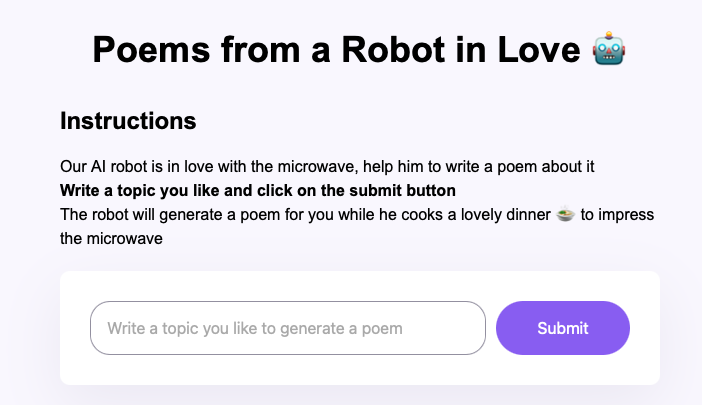

# Poem Generator
A playful project to generate short poems from user input.
- Our AI robot is in love with the microwave, help him to write a poem about it
- Write a topic you like and click on the submit button
- The robot will generate a poem for you while he cooks a lovely dinner 🍲 to impress the microwave

## Highlights
- Role: Built a small NLP prototype to transform input into creative text.
- Tech: Python, simple NLP logic (string manipulation / randomization).
- Outcome: Demonstrates text generation basics with a fun interface.

## Run
Clone repo and run the Python script in your environment.
- Preview: `https://stunning-macaron-c66d8a.netlify.app`

